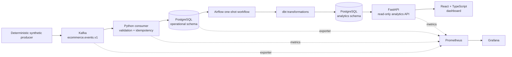
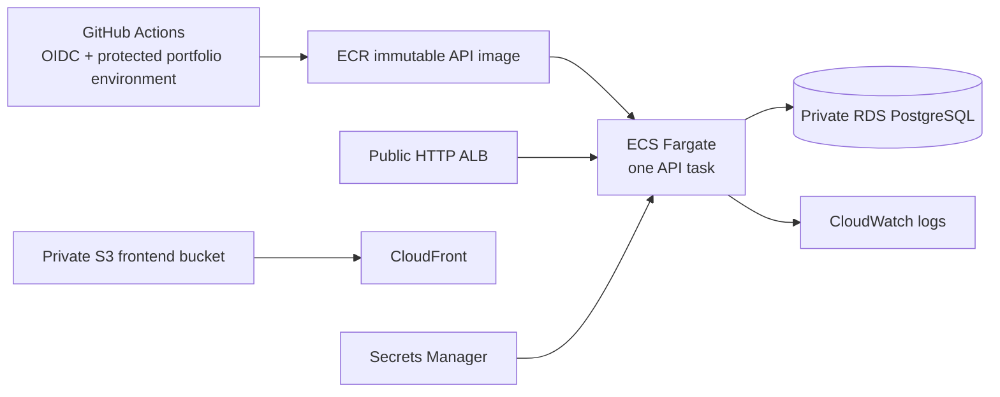

# Cloud Data Engineering Platform

An end-to-end e-commerce data platform built to demonstrate reliable event
ingestion, analytics engineering, a read-only serving layer, observability,
and a cost-conscious AWS deployment. The system uses deterministic synthetic
events, so every local demo is repeatable and contains no real customer data.

## What It Demonstrates

- Versioned Pydantic event contracts and deterministic Kafka production
- At-least-once ingestion with transactional PostgreSQL writes and `event_id`
  idempotency
- Airflow orchestration of dbt staging, intermediate, and dimensional models
- FastAPI analytics endpoints backed by the `analytics` warehouse schema
- React and TypeScript dashboard for revenue, orders, payments, products, and
  fulfillment
- Prometheus metrics, Kafka/PostgreSQL exporters, Grafana dashboards, and
  structured logs
- Terraform-managed AWS infrastructure and GitHub Actions deployment through
  short-lived OIDC credentials

This is a portfolio environment, not a claim of production-scale throughput,
availability, or performance.

## Architecture



The deployed AWS path is intentionally separate from the local Kafka and
Airflow stack:



The AWS design uses one region, no NAT Gateway, no MSK, and no MWAA. Kafka,
Airflow, and dbt remain local or controlled-job components to avoid paying for
always-on managed services in a portfolio deployment.

## Technology Stack

Python 3.11, Pydantic, confluent-kafka, PostgreSQL, Alembic, Airflow, dbt,
FastAPI, React, TypeScript, Vite, Recharts, Docker Compose, Prometheus,
Grafana, Terraform, ECS/Fargate, RDS, ECR, S3, CloudFront, CloudWatch, IAM,
GitHub Actions, and GitHub OIDC.

## Local Quick Start

```powershell
Copy-Item .env.example .env
docker compose up -d postgres kafka migrate consumer
docker compose --profile producer run --rm producer
docker compose --profile analytics run --rm analytics-dbt
docker compose --profile dashboard up -d analytics-api frontend
```

Open `http://localhost:5173` for the dashboard or
`http://localhost:8000/docs` for the API. Add observability with:

```powershell
docker compose --profile dashboard --profile observability up -d
```

Grafana is at `http://localhost:3000` and Prometheus is at
`http://localhost:9090`. The full reproducible demo is in
[docs/DEMO.md](docs/DEMO.md).

## Verified Results

The deterministic 25-event local run produced:

| Entity | Rows |
| --- | ---: |
| Processed events | 25 |
| Customers | 1 |
| Products | 4 |
| Orders | 4 |
| Order items | 4 |
| Payments | 4 |
| Inventory records | 4 |
| Shipments | 2 |

Replaying the same events kept every count unchanged, demonstrating the
`processed_events.event_id` idempotency guard.

Milestones 1 through 5 are complete and merged. The AWS environment and
GitHub OIDC deployment path were also applied and verified during Milestone 5.
The current portfolio endpoints are documented in
[docs/AWS_DEPLOYMENT.md](docs/AWS_DEPLOYMENT.md) without exposing credentials
or secret values.

## Verification

The repository includes automated Python and frontend tests, Ruff, mypy,
frontend lint/build, Compose configuration checks, Alembic SQL generation,
dbt tests, Airflow DAG regression tests, Terraform formatting/validation, and
Docker builds. Run the focused local suite with:

```powershell
pytest
ruff check .
mypy
alembic upgrade head --sql
docker compose config
docker compose --profile analytics config
docker compose --profile dashboard config
docker compose --profile observability config
Set-Location frontend
npm.cmd ci
npm.cmd run test
npm.cmd run lint
npm.cmd run build
Set-Location ..
```

See [docs/DEMO.md](docs/DEMO.md) for the complete verification sequence and
[docs/images/README.md](docs/images/README.md) for the evidence capture list.

## Security Decisions

- Synthetic data uses `example.test`; secrets stay in environment variables or
  AWS Secrets Manager and Terraform state stays outside Git.
- The GitHub deployment role trusts the immutable repository/environment OIDC
  subject and preserves the `sts.amazonaws.com` audience.
- ECS application and consumer images run as non-root users.
- RDS is private and its security group accepts PostgreSQL only from the API
  task security group.
- S3 public access is blocked and CloudFront uses origin access control.
- GitHub Actions uses `contents: read` and short-lived OIDC credentials rather
  than long-lived AWS access keys.

The public ALB is HTTP-only because no domain or certificate is provisioned;
the API is read-only and serves synthetic analytics. See
[SECURITY.md](SECURITY.md) for the residual risks and next steps.

## Status and Limitations

All five major milestones are complete and merged. Remaining limitations are
deliberate portfolio tradeoffs: one Kafka partition, one Fargate task, single-
AZ RDS, no HTTPS custom domain, no dead-letter topic, local/controlled-job
Airflow and dbt, local Terraform state, and no measured performance benchmark.

Recommended next production steps would be remote encrypted Terraform state,
HTTPS with a managed certificate, stronger network egress controls, a dead-
letter/replay workflow, automated migration operations, and load testing.

## Further Reading

- [Architecture](ARCHITECTURE.md)
- [AWS deployment](docs/AWS_DEPLOYMENT.md)
- [CI/CD and OIDC](docs/CI_CD.md)
- [Demo guide](docs/DEMO.md)
- [Interview guide](docs/INTERVIEW_GUIDE.md)
- [Resume bullets](docs/RESUME_BULLETS.md)
