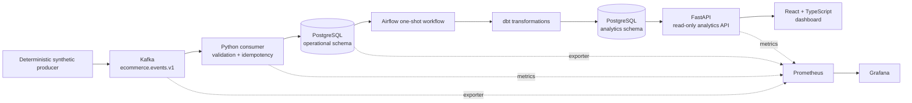
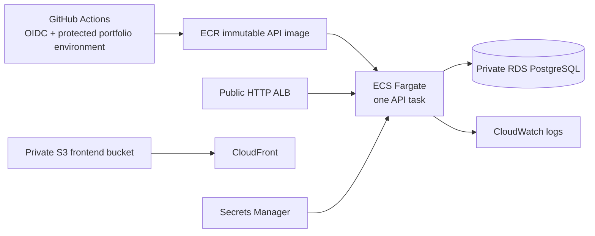
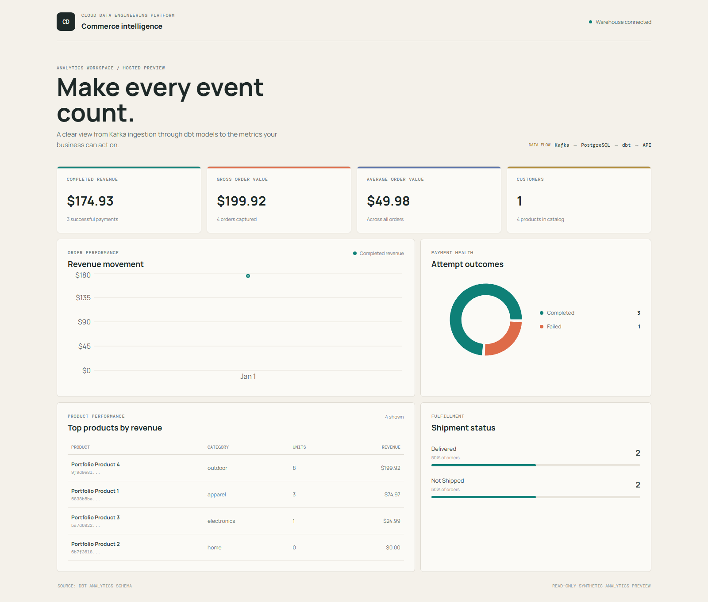
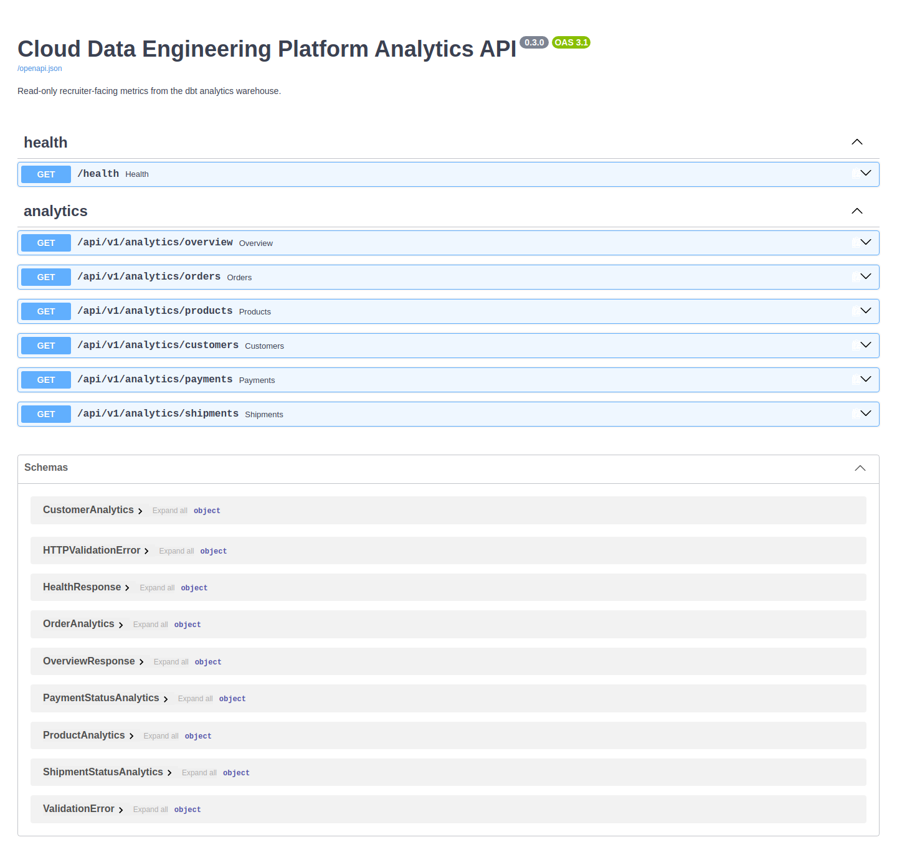
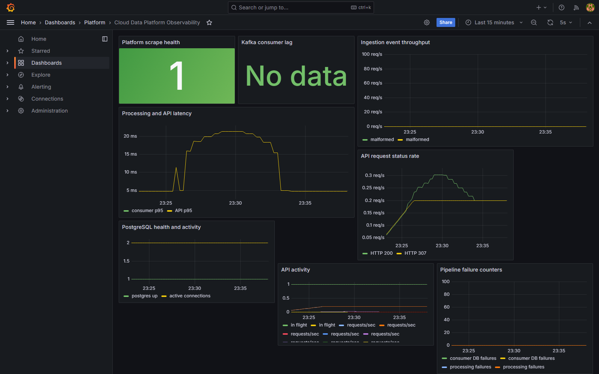
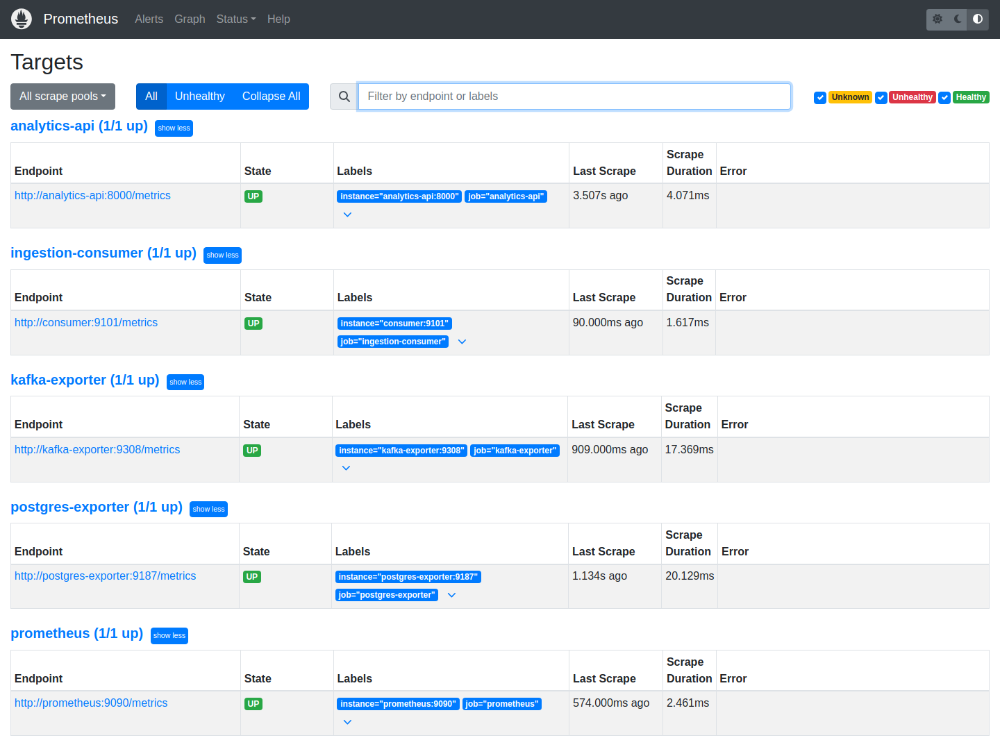

# Cloud Data Engineering Platform

[](https://github.com/fetachino/cloud-data-engineering-platform/actions/workflows/ci.yml)
[](https://www.python.org/)
[](https://kafka.apache.org/)
[](https://airflow.apache.org/)
[](https://www.getdbt.com/)
[](https://www.terraform.io/)
[](https://aws.amazon.com/)

An end-to-end e-commerce data platform demonstrating reliable event ingestion,
analytics engineering, API delivery, observability, and cost-conscious AWS
deployment. It uses deterministic synthetic events, making every local demo
repeatable without exposing real customer data.

## Engineering Highlights

- Versioned Pydantic event contracts and deterministic Kafka production
- At-least-once ingestion with transactional PostgreSQL writes and `event_id`
  idempotency
- Airflow orchestration of dbt staging, intermediate, and dimensional models
- FastAPI analytics endpoints backed by the `analytics` warehouse schema
- React and TypeScript dashboard for revenue, orders, payments, products, and
  fulfillment
- Prometheus metrics, Kafka/PostgreSQL exporters, Grafana dashboards, and
  structured logs
- Terraform-managed AWS infrastructure and GitHub Actions deployment through
  short-lived OIDC credentials

This is a portfolio environment, not a claim of production-scale throughput,
availability, or performance.

The local demo is the primary reproducible path. The AWS materials document an
optional deployment design and workflow rather than a continuously hosted
production service.

## Architecture



The deployed AWS path is intentionally separate from the local Kafka and
Airflow stack:



The AWS design uses one region, no NAT Gateway, no MSK, and no MWAA. Kafka,
Airflow, and dbt remain local or controlled-job components to avoid paying for
always-on managed services in a portfolio deployment.

## Technology Stack

| Capability | Technologies | Demonstrated ownership |
| --- | --- | --- |
| Event platform | [Python 3.11](https://www.python.org/), [Pydantic](https://docs.pydantic.dev/), [confluent-kafka](https://github.com/confluentinc/confluent-kafka-python), [Apache Kafka](https://kafka.apache.org/) | Versioned contracts, deterministic production, validation, retries, and idempotent consumption |
| Operational data | [PostgreSQL](https://www.postgresql.org/), [Alembic](https://alembic.sqlalchemy.org/), [Docker Compose](https://docs.docker.com/compose/) | Transactional persistence, migrations, foreign keys, and duplicate-event protection |
| Analytics engineering | [Apache Airflow](https://airflow.apache.org/), [dbt](https://www.getdbt.com/), [PostgreSQL](https://www.postgresql.org/) analytics schema | Orchestration, staging/intermediate models, dimensional modeling, and tests |
| Serving and frontend | [FastAPI](https://fastapi.tiangolo.com/), [React](https://react.dev/), [TypeScript](https://www.typescriptlang.org/), [Vite](https://vite.dev/), [Recharts](https://recharts.org/) | Read-only analytics APIs and an accessible KPI dashboard |
| Observability | [Prometheus](https://prometheus.io/), [Grafana](https://grafana.com/), [Kafka exporter](https://github.com/danielqsj/kafka_exporter), [PostgreSQL exporter](https://github.com/prometheus-community/postgres_exporter), structured logs | Service health, latency, throughput, consumer lag, and failure visibility |
| Cloud and delivery | [Terraform](https://developer.hashicorp.com/terraform), [Amazon ECS/Fargate](https://aws.amazon.com/fargate/), [Amazon RDS](https://aws.amazon.com/rds/), [Amazon ECR](https://aws.amazon.com/ecr/), [Amazon S3](https://aws.amazon.com/s3/), [Amazon CloudFront](https://aws.amazon.com/cloudfront/), [Amazon CloudWatch](https://aws.amazon.com/cloudwatch/) | Infrastructure as code, private database networking, container deployment, and frontend delivery |
| DevOps and security | [GitHub Actions](https://docs.github.com/en/actions), [GitHub OIDC](https://docs.github.com/en/actions/deployment/security-hardening-your-deployments/about-security-hardening-with-openid-connect), [AWS IAM](https://aws.amazon.com/iam/), [AWS Secrets Manager](https://aws.amazon.com/secrets-manager/) | CI/CD automation, short-lived credentials, protected environments, and secret isolation |

## Local Quick Start

```powershell
Copy-Item .env.example .env
docker compose up -d postgres kafka migrate consumer
docker compose --profile producer run --rm producer
docker compose --profile analytics run --rm analytics-dbt
docker compose --profile dashboard up -d analytics-api frontend
```

Open `http://localhost:5173` for the dashboard or
`http://localhost:8000/docs` for the API. Add observability with:

```powershell
docker compose --profile dashboard --profile observability up -d
```

Grafana is at `http://localhost:3000` and Prometheus is at
`http://localhost:9090`. The full reproducible demo is in
[docs/DEMO.md](docs/DEMO.md).

## Verified Results

The deterministic 25-event local run produced:

| Entity | Rows |
| --- | ---: |
| Processed events | 25 |
| Customers | 1 |
| Products | 4 |
| Orders | 4 |
| Order items | 4 |
| Payments | 4 |
| Inventory records | 4 |
| Shipments | 2 |

Replaying the same events kept every count unchanged, demonstrating the
`processed_events.event_id` idempotency guard.

## Portfolio Screenshots

### Deployed CloudFront frontend



Shows the deployed AWS frontend serving the same read-only analytics experience
through CloudFront with the warehouse connection confirmed.

### FastAPI analytics documentation



Shows the generated API contract and read-only analytics endpoints exposed by
the FastAPI serving layer.

### Grafana observability dashboard



Shows platform scrape health, Kafka consumer lag, API latency, PostgreSQL
activity, and pipeline failure metrics in Grafana.

### Prometheus target health



Shows the local API, ingestion consumer, Kafka exporter, PostgreSQL exporter,
and Prometheus targets reporting healthy status.

The current portfolio endpoints and optional AWS deployment workflow are
documented in [docs/AWS_DEPLOYMENT.md](docs/AWS_DEPLOYMENT.md) without exposing
credentials or secret values.

## Verification

The repository includes automated Python and frontend tests, Ruff, mypy,
frontend lint/build, Compose configuration checks, Alembic SQL generation,
dbt tests, Airflow DAG regression tests, Terraform formatting/validation, and
Docker builds. Run the focused local suite with:

```powershell
pytest
ruff check .
mypy
alembic upgrade head --sql
docker compose config
docker compose --profile analytics config
docker compose --profile dashboard config
docker compose --profile observability config
Set-Location frontend
npm.cmd ci
npm.cmd run test
npm.cmd run lint
npm.cmd run build
Set-Location ..
```

See [docs/DEMO.md](docs/DEMO.md) for the complete verification sequence and
[docs/images/README.md](docs/images/README.md) for the evidence capture list.

## Security Decisions

- Synthetic data uses `example.test`; secrets stay in environment variables or
  AWS Secrets Manager and Terraform state stays outside Git.
- The GitHub deployment role trusts the immutable repository/environment OIDC
  subject and preserves the `sts.amazonaws.com` audience.
- ECS application and consumer images run as non-root users.
- RDS is private and its security group accepts PostgreSQL only from the API
  task security group.
- S3 public access is blocked and CloudFront uses origin access control.
- GitHub Actions uses `contents: read` and short-lived OIDC credentials rather
  than long-lived AWS access keys.

The public ALB is HTTP-only because no domain or certificate is provisioned;
the API is read-only and serves synthetic analytics. See
[SECURITY.md](SECURITY.md) for the residual risks and next steps.

## Status and Limitations

All five major milestones are complete and merged. Remaining limitations are
deliberate portfolio tradeoffs: one Kafka partition, one Fargate task, a
single-AZ RDS deployment, no HTTPS custom domain, no dead-letter topic,
local/controlled-job Airflow and dbt, local Terraform state, and no measured
performance benchmark.

Recommended next production steps would be remote encrypted Terraform state,
HTTPS with a managed certificate, stronger network egress controls, a
dead-letter/replay workflow, automated migration operations, and load testing.

## Further Reading

- [Architecture](ARCHITECTURE.md)
- [AWS deployment](docs/AWS_DEPLOYMENT.md)
- [CI/CD and OIDC](docs/CI_CD.md)
- [Demo guide](docs/DEMO.md)
